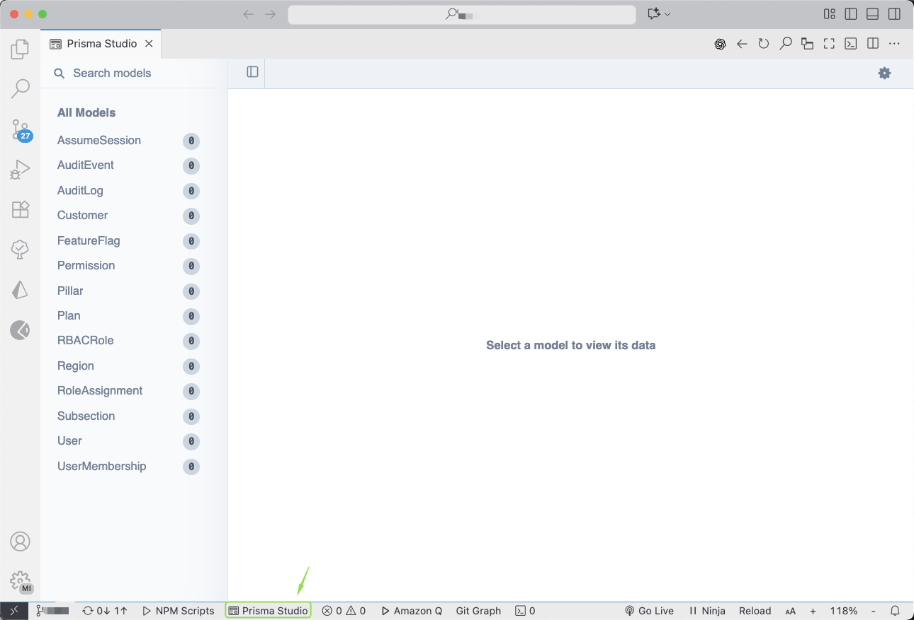

# Prisma Studio Extension for VSCode



[](https://marketplace.visualstudio.com/items?itemName=eliecer2000.prisma-studio)
[](https://marketplace.visualstudio.com/items?itemName=eliecer2000.prisma-studio)
[](https://marketplace.visualstudio.com/items?itemName=eliecer2000.prisma-studio)
[](LICENSE)

A powerful VSCode extension that seamlessly integrates Prisma Studio directly into your development environment. Access and manage your database with ease without leaving your code editor.

> **Note:** This extension is built upon the excellent foundation provided by [vscode-webpreview](https://github.com/jabed-web-dev/vscode-webpreview), which served as the base for this specialized Prisma Studio integration.

## ✨ Features

### 🚀 Core Functionality
- **Embedded Prisma Studio**: Run Prisma Studio directly within VSCode
- **Quick Access**: One-click access via status bar or keyboard shortcuts
- **Flexible URL Configuration**: Connect to any Prisma Studio instance
- **Responsive Design**: Multiple screen size presets for testing different viewports
- **Local Prisma Studio**: Start/stop Prisma Studio directly from VSCode using npx

### 🎯 Navigation & Controls
- **Browser-like Navigation**: Back, forward, and refresh controls
- **Developer Tools**: Built-in access to Chrome DevTools for debugging
- **External Browser**: Open current URL in your default browser
- **Column Toggle**: Switch between single and split-screen views
- **Responsive View**: Toggle resizable responsive preview mode

### ⚙️ Configuration Options
- **Custom URLs**: Configure default Prisma Studio URL
- **Screen Presets**: Define custom responsive breakpoints
- **Docker Settings**: Configure Docker image and database connections
- **Workspace Settings**: Per-project configuration support

## 📦 Installation

1. Open VSCode
2. Go to Extensions (`Ctrl+Shift+X`)
3. Search for "Prisma Studio"
4. Click Install on the extension by Eliezer Rangel

Alternatively, install from the [Visual Studio Marketplace](https://marketplace.visualstudio.com/items?itemName=eliecer2000.prisma-studio).

## 🚀 Quick Start

### Method 1: Status Bar
Click the "Prisma Studio" button in the status bar (bottom of VSCode).

### Method 2: Command Palette
1. Press `Ctrl+Shift+P` (Windows/Linux) or `Cmd+Shift+P` (Mac)
2. Type "Open Prisma Studio"
3. Press Enter

### Method 3: Keyboard Shortcuts
- `Ctrl+Alt+P`: Open Prisma Studio
- `Ctrl+Alt+U`: Change Prisma Studio URL

## ⌨️ Keyboard Shortcuts

| Shortcut | Command | Description |
|----------|---------|-------------|
| `Ctrl+Alt+P` | Open Prisma Studio | Launch Prisma Studio in VSCode |
| `Ctrl+Alt+U` | Prisma Studio URL | Change the current URL |

## 🛠️ Configuration

Configure the extension through VSCode settings (`settings.json`):

```json
{
  "webPreview.url": "http://localhost:5555",
  "webPreview.mediaScreenOverride": true,
  "webPreview.mediaScreen": {
    "Mobile": "375x667",
    "Tablet": "768x1024", 
    "Desktop": 1440,
    "4K": 2560
  },
  "webPreview.schemaPath": "prisma/schema.prisma",
  "webPreview.port": 5555
}
```

### Configuration Options

| Setting | Type | Default | Description |
|---------|------|---------|-------------|
| `webPreview.url` | string | `http://localhost:5555` | Default Prisma Studio URL |
| `webPreview.mediaScreenOverride` | boolean | `false` | Enable custom screen presets |
| `webPreview.mediaScreen` | object | See defaults | Custom responsive breakpoints |
| `webPreview.schemaPath` | string | `""` | Path to schema.prisma file |
| `webPreview.port` | number | `5555` | Port for Prisma Studio server |

### Default Screen Presets

```json
{
  "SM": 640,
  "MD": 768,
  "LG": 1024,
  "XL": 1280,
  "2XL": 1536
}
```

## 🚀 Local Prisma Studio

The extension runs Prisma Studio directly using npx for a simpler setup:

### Commands
- **Start Prisma Studio**: Launches Prisma Studio using npx
- **Stop Prisma Studio**: Stops the running Prisma Studio process

### Requirements
- Node.js installed
- Prisma schema file in your project

### Usage
1. Open a workspace with a Prisma project (recommended)
2. Use Command Palette → "Start Prisma Studio"
3. The extension will automatically find your schema.prisma file or ask you to select it
4. Access Prisma Studio at `http://localhost:5555`

### Schema File Detection
The extension automatically searches for `schema.prisma` files in these locations:
- `prisma/schema.prisma`
- `packages/prisma/schema.prisma`
- `apps/api/prisma/schema.prisma`
- `schema.prisma` (root directory)

If not found, you'll be prompted to select your `schema.prisma` file manually.

## 🎮 Available Commands

Access these commands via Command Palette (`Ctrl+Shift+P`):

| Command | Description |
|---------|-------------|
| `Open Prisma Studio` | Launch Prisma Studio interface |
| `Prisma Studio URL` | Change the current URL |
| `Start Prisma Studio` | Start Prisma Studio using npx |
| `Stop Prisma Studio` | Stop running Prisma Studio process |

### Panel Controls

When Prisma Studio is active, additional controls appear in the editor toolbar:

- **Back** (`←`): Navigate to previous page
- **Refresh** (`⟳`): Reload current page  
- **URL** (`🔍`): Change current URL
- **Toggle View** (`⊞`): Switch between column layouts
- **Responsive** (`📱`): Toggle responsive view mode
- **Dev Tools** (`⚒`): Open Chrome DevTools
- **External** (`↗`): Open in default browser

## 📋 Usage Examples

### Basic Usage
```bash
# Start your Prisma Studio locally
npx prisma studio

# Open VSCode and use Ctrl+Alt+P to access it
```

### Custom Configuration
```json
{
  "webPreview.url": "http://localhost:5555",
  "webPreview.schemaPath": "packages/prisma/schema.prisma",
  "webPreview.port": 5555
}
```

### Responsive Testing
```json
{
  "webPreview.mediaScreenOverride": true,
  "webPreview.mediaScreen": {
    "iPhone": "375x812",
    "iPad": "768x1024",
    "Desktop": 1920
  }
}
```

## 🔧 Troubleshooting

### Common Issues

**Prisma Studio not loading**
- Ensure Prisma Studio is running on the configured URL
- Check if the URL is accessible in your browser
- Verify firewall settings

**Prisma Studio fails to start**
- Ensure Node.js is installed
- Check if port 5555 is available
- Verify your `schema.prisma` file exists and is valid
- Make sure your database is accessible
- Open a workspace folder for better schema detection

**Schema file not found**
- Ensure your file is named exactly `schema.prisma`
- Check that the file is in one of the common locations
- Use the file picker to manually select your schema file

**Configuration errors**
- If you get workspace configuration errors, try opening a folder/workspace
- Configuration will fall back to global settings if no workspace is open

**Extension not responding**
- Reload VSCode window (`Ctrl+Shift+P` → "Reload Window")
- Check VSCode Developer Console for errors
- Restart VSCode

### Getting Help

1. Check the [GitHub Issues](https://github.com/eliecer2000/vscode-prisma-studio/issues)
2. Create a new issue with detailed information
3. Include VSCode version, extension version, and error messages

## 🤝 Contributing

Contributions are welcome! This project is actively maintained and we're continuously working on improvements and new features.

### Development Setup

1. Clone the repository
```bash
git clone https://github.com/eliecer2000/vscode-prisma-studio.git
cd vscode-prisma-studio
```

2. Install dependencies
```bash
npm install
```

3. Open in VSCode and press `F5` to launch Extension Development Host

### Planned Features

- 🔄 Auto-refresh when schema changes
- 🎨 Custom themes and styling options
- 📊 Database metrics and monitoring
- 🔐 Enhanced security features
- 🌐 Multi-database support
- 📱 Improved mobile responsiveness

## 📄 License

This project is licensed under the MIT License - see the [LICENSE](LICENSE) file for details.

## 🙏 Acknowledgments

- Built upon [vscode-webpreview](https://github.com/jabed-web-dev/vscode-webpreview) by jabed-web-dev
- Inspired by the Prisma community and their excellent tooling
- Thanks to all contributors and users providing feedback

## 👨‍💻 Author

**Eliezer Rangel**
- GitHub: [@eliecer2000](https://github.com/eliecer2000)
- Extension: [Prisma Studio](https://marketplace.visualstudio.com/items?itemName=eliecer2000.prisma-studio)

---

⭐ If you find this extension helpful, please consider giving it a star on [GitHub](https://github.com/eliecer2000/vscode-prisma-studio) and leaving a review on the [VSCode Marketplace](https://marketplace.visualstudio.com/items?itemName=eliecer2000.prisma-studio)!